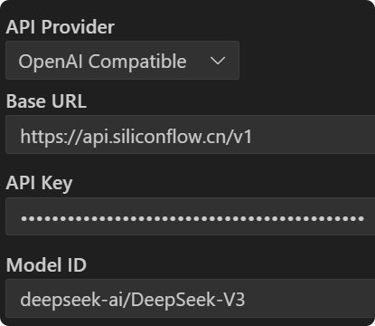

# MCP-Learn 使用指南

本项目提供了 Model Context Protocol (MCP) 使用的示例和教程，帮助你了解如何配置和使用 MCP 服务。


## 1. 环境配置

### 1.1 安装依赖

首先，确保你已经安装了 Python 环境。我们推荐使用 uv 包管理工具来管理依赖：

```bash
# 安装 uv（如果尚未安装）
pip install -U uv
git clone git@github.com:XavierZXY/agent-boom.git
# 安装项目依赖
uv sync
```

### 1.2 Cline配置
在vscode中安装 `Cline` 插件，并在设置中配置 `Cline` 的 API 密钥。


### 1.3 配置 MCP 模型

本项目使用 `models.list` 文件中指定的模型:
- deepseek-ai/DeepSeek-V3
- THUDM/GLM-4-32B-0414
请确保你已经配置好访问这些模型的权限。更强的模型可以提供更好的性能。


### 1.4 配置cline的mcp服务


把`cline-config.json`的内容复制到刚刚对应的`cline`配置中。
注意要把`~/codes/agent-boom/mcp-learn/server`,`~/.local/bin/uv`配置成你本地的路径。

配置正确后，你应该看到cline中已经有可用的`mcp`服务。


## 2. 简单的 MCP 使用

### 2.1 运行日期服务
现在我们使用`deepseek-ai/DeepSeek-V3`模型来运行一个简单的日期服务。
你可以在对话栏中输入以下`prompt`:
```text
请使用mcp tool来获取当前日期。
```

### 2.2 水果密码示例

`secret_fruits.py` 提供了获取水果信息的服务，包括随机水果和基于日期的水果。

主要功能：
- `get_fruits()`: 随机返回一个水果及其表情符号
- `get_fruit_by_date(year, month, day)`: 根据星期几返回特定水果

简单实用：
```text
请使用mcp tool来获取水果密码，最后只给我对应的emoji。
```
## 3. 使用多个 MCP 联合工作

### 3.1 联合调用示例

你可以同时运行多个 MCP 服务，并在应用中协同使用它们,如可以使用`get_date.py` 和 `secret_fruits.py` 进行联合调用。

```text
请使用mcp tool来获取当前日期和当前日期所对应的水果密码。
``` 

### 3.2 api请求的mcp
使用`weather`提供了一个天气查询的 MCP 服务，可以通过调用外部 API 来获取天气信息。

### 3.3 More
可以使用`weather`和高德地图的`mcp`服务来指定一份云南七日游的行程安排。

## 4. 总结

MCP (Model Context Protocol) 提供了一种标准化的方式来构建和使用工具，使得大语言模型可以更容易地调用外部功能。通过本指南中的示例，你可以了解如何：

1. 配置基本的 MCP 服务
2. 创建返回简单数据的工具
3. 协调多个 MCP 服务一起工作
4. 集成外部 API 调用到 MCP 工具中

这些示例提供了构建更复杂应用的基础，你可以根据自己的需求扩展这些服务或创建新的`MCP`工具。

# More info

- [MCP广场](https://modelscope.cn/mcp)
- [modelcontextprotocol](https://modelcontextprotocol.io/introduction)
- [MCP幼儿园级教程，让你的AI自己干活！【小白教程】](https://www.bilibili.com/video/BV1HFd6YhErb/?spm_id_from=333.337.search-card.all.click&vd_source=4b89af53720f562b658eda17f36f478f)